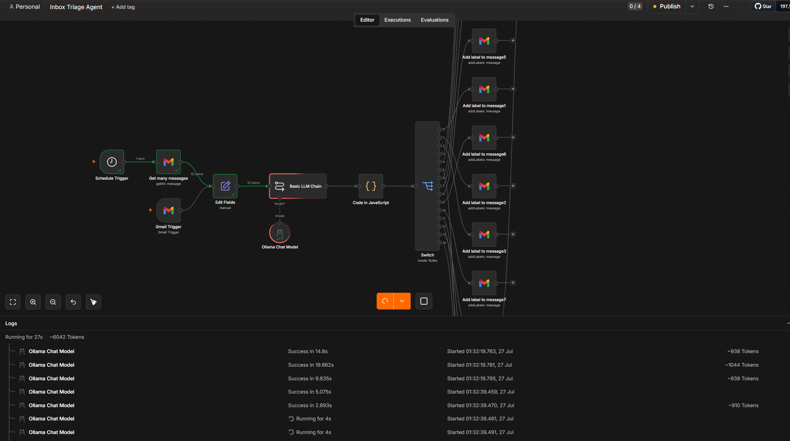
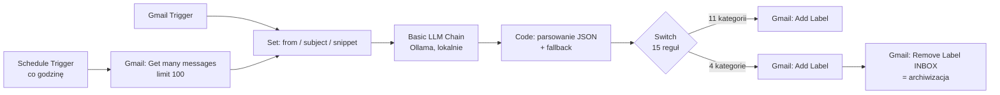

# Inbox Triage Agent

Automatyczna segregacja skrzynki Gmail w n8n z klasyfikacją lokalnym modelem LLM (Ollama).
Workflow pobiera nieprzeczytane maile, klasyfikuje je do jednej z 15 kategorii, nadaje odpowiednią
etykietę `Auto/*`, a maile o niskim priorytecie dodatkowo archiwizuje.

Model działa lokalnie — treść maili nie opuszcza komputera.



## Jak to działa



1. **Pobranie** — `Schedule Trigger` co godzinę uruchamia zapytanie do Gmaila:
   `in:inbox is:unread` z wykluczeniem wszystkich 15 etykiet `Auto/*`, żeby nie przetwarzać
   tej samej wiadomości dwa razy. Alternatywnie workflow startuje z `Gmail Trigger` (na żywo).
2. **Przygotowanie promptu** — z każdej wiadomości brane są tylko `from`, `subject` i `snippet`.
   Pełna treść maila nigdy nie jest wysyłana do modelu.
3. **Klasyfikacja** — `Basic LLM Chain` z modelem Ollama zwraca JSON:
   `{"category": "...", "action": "label|archive", "reason": "..."}`.
4. **Parsowanie** — węzeł Code wyciąga JSON z odpowiedzi modelu (radzi sobie z modelem
   owijającym JSON tekstem) i dokleja `id` oraz `threadId` z oryginalnej wiadomości.
   Gdy parsowanie się nie uda, wiadomość ostrożnościowo trafia do `WAZNE`.
5. **Routing** — `Switch` w trybie Rules kieruje na jedno z 15 wyjść.
6. **Akcja** — każda kategoria ma dedykowany węzeł `Add Label`. Cztery kategorie
   (`POWIADOMIENIE`, `NEWSLETTER`, `SPAM`, `EDUKACJA`) przechodzą dodatkowo przez
   `Remove Label: INBOX`, co w Gmailu oznacza archiwizację.

## Kategorie

| # | Kategoria | Etykieta Gmail | Akcja |
|---|---|---|---|
| 0 | `OFERTA_PRACY` | `Auto/Praca` | etykieta |
| 1 | `FAKTURA` | `Auto/Faktury` | etykieta |
| 2 | `WAZNE` | `Auto/Wazne` | etykieta |
| 3 | `NEWSLETTER` | `Auto/Newsletter` | etykieta + archiwizacja |
| 4 | `SPAM` | `Auto/Spam` | etykieta + archiwizacja |
| 5 | `ZAPROSZENIE_SIEC` | `Auto/Kontakty` | etykieta |
| 6 | `POWIADOMIENIE` | `Auto/Powiadomienia` | etykieta + archiwizacja |
| 7 | `BEZPIECZENSTWO` | `Auto/Bezpieczenstwo` | etykieta |
| 8 | `REKRUTACJA_ODPOWIEDZ` | `Auto/Rekrutacja-Odpowiedz` | etykieta |
| 9 | `DO_SPRAWDZENIA` | `Auto/Do-Sprawdzenia` | etykieta |
| 10 | `PRAWNE` | `Auto/Prawne` | etykieta |
| 11 | `SUBSKRYPCJE` | `Auto/Subskrypcje` | etykieta |
| 12 | `BANKOWOSC` | `Auto/Bankowosc` | etykieta |
| 13 | `EDUKACJA` | `Auto/Edukacja` | etykieta + archiwizacja |
| 14 | `STUDIA` | `Auto/Studia` | etykieta |

Pełna treść promptu systemowego: [`prompts/classifier-system-prompt.md`](prompts/classifier-system-prompt.md).

## Wyniki

Ostatni przebieg na próbie **100 nieprzeczytanych maili**: 5 min 27 s, **0 błędów**,
wszystkie wiadomości otrzymały etykietę.

| Kategoria | Trafienia |
|---|---:|
| `OFERTA_PRACY` | 78 |
| `EDUKACJA` | 7 |
| `REKRUTACJA_ODPOWIEDZ` | 4 |
| `WAZNE` | 3 |
| `NEWSLETTER` | 2 |
| `SUBSKRYPCJE` | 2 |
| `STUDIA` | 2 |
| `FAKTURA` | 1 |
| `ZAPROSZENIE_SIEC` | 1 |

Dominacja `OFERTA_PRACY` odzwierciedla realny skład skrzynki (alerty z LinkedIn i Pracuj.pl),
a nie błąd klasyfikatora — ręczny przegląd uzasadnień to potwierdził.

## Uruchomienie u siebie

**Wymagania:** n8n, [Ollama](https://ollama.com) z pobranym modelem, konto Google z włączonym API Gmail.

1. Utwórz w Gmailu 15 etykiet z tabeli powyżej.
2. Zaimportuj [`workflow/inbox-triage-agent.json`](workflow/inbox-triage-agent.json)
   (n8n → *Import from file*).
3. Podepnij własne poświadczenia **Gmail OAuth2** — w eksporcie są usunięte, zostały tylko nazwy.
4. W każdym węźle `Label: *` wybierz swoją etykietę z listy. Identyfikatory `Label_...`
   w pliku są przypisane do konkretnego konta Google i u Ciebie nie zadziałają.
5. Podepnij węzeł **Ollama Chat Model** do swojej instancji.
6. Sprawdź `Get many messages` → *Limit* i częstotliwość `Schedule Trigger`.
   100 maili to ok. 5,5 min na lokalnym modelu — przy uruchomieniu co godzinę warto zejść do 10–20.

## Napotkane problemy i rozwiązania

**Brak prefiksu `=` w polu Message ID.** Dziesięć węzłów Gmail miało `{{ $json.id }}` zamiast
`={{ $json.id }}`. n8n traktuje wartość bez `=` jako zwykły tekst, więc do API Gmaila leciał
literalny ciąg `{{ $json.id }}` — błąd *Bad request* / *Invalid id value*. Objawiało się to
losowo, bo zależało od tego, które kategorie trafiły się w danej partii maili.

**Przesunięcie wyjść Switcha.** Po dodaniu nowych reguł połączenia rozjechały się o jedno
wyjście — `PRAWNE` nie miało podpiętego żadnego węzła, a `EDUKACJA` była podpięta dwa razy.
Mapowanie odtworzone 1:1 i zweryfikowane porównaniem `rules.values[i].rightValue`
z `connectionsBySourceNode`.

**Alerty o pracy z LinkedIn trafiały do `ZAPROSZENIE_SIEC`.** Model mylił maile
„New jobs similar to…" z zaproszeniami do kontaktu, bo oba przychodzą z LinkedIn. Prompt
doprecyzowano: `OFERTA_PRACY` wprost wymienia frazy alertów ofertowych, a `ZAPROSZENIE_SIEC`
zawężono do zaproszeń od konkretnej osoby z jawnym zakazem używania tej kategorii dla ofert.

**Sporadyczny błąd Gmail API przy `POWIADOMIENIE`.** Po naprawieniu prefiksu `=` problem nie
wystąpił ponownie. Na wszelki wypadek węzeł ma włączone *Retry on Fail* (3 próby, 2 s przerwy).

## Struktura repo

```
├── workflow/
│   └── inbox-triage-agent.json      # eksport n8n (bez poświadczeń)
├── prompts/
│   └── classifier-system-prompt.md  # prompt systemowy klasyfikatora
└── docs/img/                        # zrzuty ekranu
```

## Stack

n8n · Ollama (lokalny LLM) · Gmail API (OAuth2)
